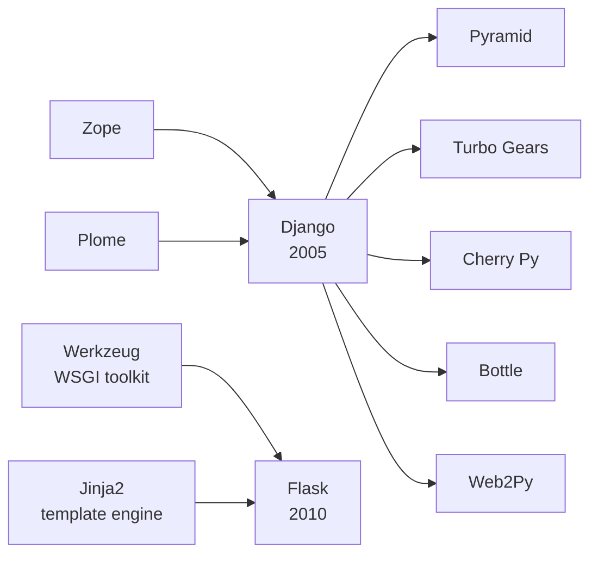

# Python Resources                     

[TOC]
## Python Language

* [The Import Statement](http://effbot.org/pyfaq/tutor-whats-the-difference-between-import-foo-and-from-foo-import.htm)
* [Regular Expressions](https://memyselfandpython.wordpress.com/2018/01/18/regular-expression-cheat-sheet-python/)              [Simple Regex Cheat Sheet PDF](https://www.py4e.com/lectures/Py4Inf-11-Regex-Guide.pdf)

## Development Environments

* [Jupyter (browser-base notebooks)](https://jupyter.org/index.html)

* [Jupyter Labs (video)](https://youtu.be/w7jq4XgwLJQ)

* [PyCharm IDE](https://www.jetbrains.com/pycharm/specials/pycharm/pycharm.html)

## Learning Python

### Online Courses, Classes, Tutorials and Examples

* [Python for Everyone](https://www.py4e.com/)

  (Local copy of book on PC and iPad)

* [My Udemy Python Courses](https://www.udemy.com/home/my-courses/learning/)

* [Codecademy: Learn to code interactively, for free](https://www.codecademy.com/)

* [Data Camp](https://www.datacamp.com/)                (linked to google+ account)

* [Gallery of Interesting Jupyter Notebooks](https://github.com/jupyter/jupyter/wiki/A-gallery-of-interesting-Jupyter-Notebooks)

* [Survey of Best Web Sites and Courses For Learning Python](https://memyselfandpython.wordpress.com/2018/01/14/best-online-courses-for-learning-python/)

### Games and Challenges

* [Survey of Gamification Platforms (Article)](https://getbadges.io/blog/12-gamification-platforms-that-help-learn-coding)
* [Injection: Python programming adventure game](https://schilcote.itch.io/injection)

- [Untrusted: The continuing adventures of Dr. Eval](https://alexnisnevich.github.io/untrusted/)

- [Python and Ladders:  a free, interactive, and self-paced resource for beginners to programming](http://www.pythonsandladders.com/)

* [Python Challenge](http://www.pythonchallenge.com/)

* [CheckIO Coding Games for Python and Java](https://checkio.org)
* [CodinGame](https://www.codingame.com/start)   (improve your programming skills while having fun and getting noticed)

* [Codewars: Achieve mastery through challenge](https://www.codewars.com/)   (Improve your skills by training with others on real code challenges)

* [Exercism: Download and solve practice problems in over 30 different languages](http://exercism.io)

## Profiling

* [Built-in profile and cProfile Modules](http://www.integralist.co.uk/posts/profiling-python/#7)
* [Built-in timeit Module](http://www.integralist.co.uk/posts/profiling-python/#6)
* [Profiling Python Code in Jupyter Notebooks](http://gouthamanbalaraman.com/blog/profiling-python-jupyter-notebooks.html)
* [profile, cProfile, and pstats](https://pymotw.com/2/profile/index.html)
* [trace](https://pymotw.com/2/trace/index.html)        (follows Python statements as they are executed)

## Machine Learning

* [TensorFlow](https://www.tensorflow.org/)
* [TensorFlow's Python API](https://www.tensorflow.org/api_docs/python/)

## Datasets (free and open to public)

* [IMDB Movie Data](http://www.imdb.com/interfaces/)
* [US Forest Service Data](https://cloud.google.com/blog/big-data/2017/10/get-to-know-your-trees-us-forest-service-fia-dataset-now-available-in-bigquery)
* [LIGO Data Science Tutorials](https://losc.ligo.org/tutorials/)  >  Binary Black Hole Events  >  Jupyter notebook

## Data Science

* [Overview of Data Science Packages (video)](https://www.youtube.com/watch?v=K-kTtqF2vQA)
* [Alfred Essa's Awesome Data Science (video)](https://www.youtube.com/watch?v=e9cSF3eVQv0) 
  This is part one of a multi-part instructional video series (local copy downloaded to home PC)
* [Pandas in 10 minutes](http://pandas.pydata.org/pandas-docs/stable/10min.html)
* [Python for Econometrics](https://www.kevinsheppard.com/Python_for_Econometrics)  (Kevin Sheppard, 3rd Ed, 2017)
  Python for Econometrics, Statistics and Numerical Analysis

## Scientific Computing

Pandas (data frames)

NumPy (vectorization)

* [NumPy Intro](https://docs.scipy.org/doc/numpy/user/quickstart.html)  
  Excellent documentation and tutorials for the entire SciPy stack
* [Pandas Intro (video)](https://www.youtube.com/watch?v=p8hle-ni-DM)

## Graphing Packages

* [seaborn: statistical data visualization](https://seaborn.pydata.org/)
* [Bokeh is a Python interactive visualization library](https://bokeh.pydata.org/en/latest/)
* [HoloViews](http://holoviews.org/) > Jupyter > `conda install -c ioam holoviews bokeh`

## Web Development

There are two dominant Python frameworks for web development: **Flask** and **Django**.  Flask has the quickest ramp up, while Django offers greater flexibility and control over the end product.

Flask started in 2010 as an April Fool's joke.   As of mid 2016, Flask was the most popular Python web development framework on [GitHub](https://en.wikipedia.org/wiki/GitHub)

"Family Tree" of Python Web Development Frameworks

* [Flask vs Django (video)](https://www.youtube.com/watch?v=KnbAUplWXC0)
* [Flask home](http://flask.pocoo.org/)
* [Flask Tutorial]( https://blog.miguelgrinberg.com/post/the-flask-mega-tutorial-part-i-hello-world)
* [Django home](https://www.djangoproject.com/)

## Testing

* [Unittest vs Nose vs Pytest](http://pythontesting.net/transcripts/2-pytest-vs-unittest-vs-nose/)
* [Unit Testing with Pytest (video)](https://www.youtube.com/watch?v=l32bsaIDoWk)

## Miscellaneous

- [Newspaper Package](http://newspaper.readthedocs.io/en/latest/)
- [PyBites Code Challenges](https://pybit.es/codechallenge01.html)
- [Python and Blockchain](https://www.reddit.com/r/Python/comments/7qho7w/learning_about_block_chain_with_python_anna/?utm_source=reddit-android)

