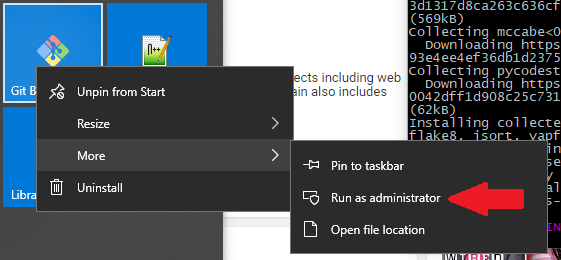

# Using Python to Send Daily Readings

## Tutorials, Tips and Reference Info

### [Setting up VIM for Python development (VIDEO)](https://www.youtube.com/watch?v=vlb3qUiS2ZY)

### [Tutorial (VIDEO)](https://www.youtube.com/watch?v=mP_Ln-Z9-XY)

### [HTML Page Scraping with Python](https://python-docs.readthedocs.io/en/latest/scenarios/scrape.html)

### [Sending Email Using Gmail and Python](https://www.scivision.co/send-email-gmail-python)

### [Google App Passwords](https://support.google.com/accounts/answer/185833?hl=en)

### Test account: Ken EBob

Email address: `KennethB314159265358979@gmail.com`

Password: `12345678!@#$%^&*`

### Other [Search Results](https://www.google.com/search?q=python+send+email+gmail&safe=active&source=lnt&tbs=qdr:y&sa=X&ved=0ahUKEwie_5ud44DeAhXDmOAKHf18D0gQpwUIJQ&biw=1745&bih=853)


## Launch Git Bash as Administrator




## Use `pip` to install `pep8`, etc.

```
$ pip install pep8 flake8 pyflakes isort yapf
```

**Optional**: install sorted container library

`$ pip install sortedcontainers`

## Get `.vimrc` from https://github.com/fisadev/fisa-vim-config

## Sample program

```python
"""
A simple Hello World program
"""
print("Hello")
for i in range(5):
    print(i)
```


```
$ python hello.py
Hello
0
1
2
3
4
```

## Sorted Containers Example

```python
$ python
Python 3.6.4 (v3.6.4:d48eceb, Dec 19 2017, 06:54:40) [MSC v.1900 64 bit (AMD64)]
 on win32
Type "help", "copyright", "credits" or "license" for more information.
>>> from sortedcontainers import SortedSet
>>> ss = SortedSet('abracadabra')
>>> ss
SortedSet(['a', 'b', 'c', 'd', 'r'])

```

